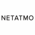

#  Netatmo **flow**ground Connector

## Description

A generated **flow**ground connector for the Netatmo API (version 1.1.1).

Generated from: https://api.apis.guru/v2/specs/netatmo.net/1.1.1/swagger.json 
Generated at: 2019-07-08T14:35:56+03:00

## API Description

<h3>Welcome to the Netatmo swagger on-line documentation !</h3>This site is a complement to the official <a href="https://dev.netatmo.com/">Netatmo developper documentation</a> using swagger to bring interactivity and easy testing of requests with the "try it" button (authenticate with the authorization code 0Auth2 flow by clicking the authenticate button in the methods). You can find the source code for this site can be found in the project <a href="https://github.com/cbornet/netatmo-swagger-ui">netatmo-swagger-ui</a>. You can also use the online <a href="./swagger.json">swagger declaration</a> file to generate code or static documentation (see <a href="https://github.com/cbornet/netatmo-swagger-api">netatmo-swagger-api</a>). 

## Authorization

Supported authorization schemes:
- OAuth2
- OAuth2

For OAuth 2.0 you need to specify OAuth Client credentials as environment variables in the connector repository:
* `OAUTH_CLIENT_ID` - your OAuth client id
* `OAUTH_CLIENT_SECRET` - your OAuth client secret

## Actions

### addwebhook
> Links a callback url to a user. 

*Tags:* `welcome`

#### Input Parameters
* `url` - _required_ - Your webhook callback url 
* `app_type` - _required_ - Webhooks are only available for Welcome, enter app_camera. 

### createnewschedule
> The method createnewschedule creates a new schedule stored in the backup list. 

*Tags:* `thermostat`

#### Input Parameters
* `device_id` - _required_ - The relay id 
* `module_id` - _required_ - The thermostat id 

### devicelist
> The method devicelist returns the list of devices owned by the user, and their modules. 
> A device is identified by its _id (which is its mac address) and each device may have one, several or no modules, also identified by an _id. 

*Tags:* `station` `thermostat` `partner`

#### Input Parameters
* `app_type` - _optional_ - Defines which device type will be returned by devicelist. It could be app_thermostat or app_station (by default if not provided) 
    Possible values: app_thermostat, app_station.
* `device_id` - _optional_ - Specify a device_id if you want to retrieve only this device informations. 
* `get_favorites` - _optional_ - When set to "true", the favorite devices of the user are returned. This flag is available only if the devices requested are Weather Stations. 

### dropwebhook
> Dissociates a webhook from a user. 

*Tags:* `welcome`

#### Input Parameters
* `app_type` - _required_ - For Welcome, use app_camera 

### getcamerapicture
> Returns the snapshot associated to an event. 

*Tags:* `welcome`

#### Input Parameters
* `image_id` - _required_ - id of the image (can be retrieved as 'id' in 'face' in Gethomedata, or as 'id' in 'snapshot' in Getnextevents, Getlasteventof and Geteventsuntil) 
* `key` - _required_ - Security key to access snapshots. 

### geteventsuntil
> Returns the snapshot associated to an event. 

*Tags:* `welcome`

#### Input Parameters
* `home_id` - _required_ - ID of the Home you're interested in 
* `event_id` - _required_ - Your request will retrieve all the events until this one 

### gethomecoachsdata
> The method gethomecoachsdata Returns data from a user Healthy Home Coach Station (measures and device specific data). 

*Tags:* `healthyhomecoach`

#### Input Parameters
* `device_id` - _optional_ - Id of the device you want to retrieve information of 

### gethomedata
> Returns information about users homes and cameras. 

*Tags:* `welcome`

#### Input Parameters
* `home_id` - _optional_ - Specify if you're looking for the events of a specific Home. 
* `size` - _optional_ - Number of events to retrieve. Default is 30. 

### getlasteventof
> Returns most recent events. 

*Tags:* `welcome`

#### Input Parameters
* `home_id` - _required_ - ID of the Home you're interested in 
* `person_id` - _required_ - Your request will retrieve all events of the given home until the most recent event of the given person 
* `offset` - _optional_ - Number of events to retrieve. Default is 30. 

### getmeasure
> The method getmeasure returns the measurements of a device or a module. 

*Tags:* `station` `thermostat` `partner` `public`

#### Input Parameters
* `device_id` - _required_ - Id of the device whose module's measurements you want to retrieve. This _id can be found in the user's devices field. 
* `module_id` - _optional_ - If you don't specify any module_id you will retrieve the device's measurements. If you specify a module_id you will retrieve the module's measurements. 
* `scale` - _required_ - Defines the time interval between two measurements. 
Possible values : 
max -> every value stored will be returned 
30min -> 1 value every 30 minutes 
1hour -> 1 value every hour 
3hours -> 1 value every 3 hours 
1day -> 1 value per day 
1week -> 1 value per week 
1month -> 1 value per month 
    Possible values: max, 30min, 1hour, 3hours, 1day, 1week, 1month.
* `type` - _required_ - Sets the type of measurement you want to retrieve. 
The different types of measurements must be given in a comma separated list of strings. 
Example: type="Temperature,Humidity" 
Depending on the device's type and the scale, different measurements are available: 
For Weather Station : 
 
  max -> Temperature, CO2, Humidity, Pressure, Noise, Rain (if 
module_id is a rain sensor) 
 
  30min, 1hour, 3hours -> Temperature, CO2, Humidity, Pressure, 
Noise, min_temp, max_temp, min_hum, max_hum, min_pressure, max_pressure, min_noise, max_noise, sum_rain (if module_id is a rain sensor) 
 
  1day, 1week, 1month -> Temperature, Co2, Humidity, Pressure, Noise, 
min_temp, date_min_temp, max_temp, date_max_temp, min_hum, date_min_hum, max_hum, date_max_hum, min_pressure, date_min_pressure, max_pressure, date_max_pressure, min_noise, date_min_noise, max_noise, date_max_noise, date_min_co2, date_max_co2, sum_rain (if module_id is a rain sensor) 
Please note, the measurements sent in the response will be in the same order as in this list. 
All measurements are expressed in metric units: 
 
  Temperature: Celsius 
 
  Humidity: % 
 
  Co2: ppm 
 
  Pressure: mbar 
 
  Noise: db 
 
  Rain: mm 
 
For Thermostat: 
 
  max -> Temperature, Sp_Temperature, BoilerOn, BoilerOff 
 
  30min, 1hour, 3hours -> Temperature, Sp_Temperature, min_temp, 
max_temp, sum_boiler_on, sum_boiler_off 
 
  1day, 1week, 1month -> Temperature, min_temp, date_min_temp, 
max_temp, sum_boiler_on, sum_boiler_off 
 
  where 
 
Temperature: Celsius 
 
  Sp_Temperature (temperature setpoint): Celsius 
 
  BoilerOn: Duration, since the previous data point, during which the 
boiler has been on (in seconds) 
 
  BoilerOff : Duration, since the previous data point, during which 
the boiler has been off (in seconds). 
 
  sum_boiler_on: Total duration during which the boiler has been on, 
at a specific scale (in seconds). 
 
  sum_boiler_off: Total duration during which the boiler has been 
off, at a specific scale (in seconds). 
* `date_begin` - _optional_ - Starting timestamp (utc) of the requested measurements. 
Please note measurement retrieving is limited to 1024 measurements. 
* `date_end` - _optional_ - Ending timestamp (utc) of the request measurements. 
If you want only the last measurement, do not provide date_begin, and set date_end to "last". 
* `limit` - _optional_ - Limits the number of measurements returned (default & max is 1024) 
* `optimize` - _optional_ - Allows you to choose the format of the answer. 
If you build a mobile app and bandwith usage is an issue, use optimize = true. 
Use optimize = false, for an easier parse. In this case, values are indexed by sorted timestamp. 
Example of un-optimized response : 
{"status": "ok", 
  "body": { 
    "1347575400": [18.3,39], 
    "1347586200": [20.6,48] 
  }, 
"time_exec": 0.012136936187744} 
If optimize is set true, measurements are returned as an array of series of regularly spaced measurements. Each series is defined by a beginning time beg_time and a step between measurements, step_time: 
{"status": "ok", 
  "body": [ 
    {"beg_time": 1347575400, 
     "step_time": 10800, 
     "value": 
        [[18.3,39], 
        [ 20.6,48]] 
    }], 
"time_exec": 0.014238119125366} 
Default value is true. 
* `real_time` - _optional_ - In scales higher than max, since the data is aggregated, the timestamps returned are by default offset by +(scale/2). 
For instance, if you ask for measurements at a daily scale, you will receive data timestamped at 12:00 if real_time is set to false (default case), and timestamped at 00:00 if real_time is set to true. 
NB : The servers always store data with real_time set to true and data are offset by this parameter AFTER having being time-filtered, thus you could have data after date_end if real_time is set to false. 

### getnextevents
> Returns previous events. 

*Tags:* `welcome`

#### Input Parameters
* `home_id` - _required_ - ID of the Home you're interested in 
* `event_id` - _required_ - Your request will retrieve events occured before this one 
* `size` - _optional_ - Number of events to retrieve. Default is 30. 

### getstationsdata
> The method getstationsdata Returns data from a user Weather Stations (measures and device specific data). 

*Tags:* `station`

#### Input Parameters
* `device_id` - _optional_ - Id of the device you want to retrieve information of 

### getthermostatsdata
> The method getthermostatsdata returns information about user's thermostats such as their last measurements. 

*Tags:* `thermostat`

#### Input Parameters
* `device_id` - _optional_ - Id of the device you want to retrieve information of 

### getthermstate
> The method getthermstate returns the last Thermostat measurements, its current weekly schedule, and, if present, its current manual temperature setpoint. 

*Tags:* `thermostat` `partner`

#### Input Parameters
* `device_id` - _required_ - The relay id 
* `module_id` - _required_ - The thermostat id 

### getuser
> The method getuser returns information about a user such as prefered language, prefered units, and list of devices. 

*Tags:* `station` `thermostat`

### partnerdevices
> The method partnerdevices returns the list of device_id to which your partner application has access to. 

*Tags:* `partner`

### setpersonsaway
> Sets a person as 'Away' or the Home as 'Empty'. The event will be added to the user's timeline. 

*Tags:* `welcome`

#### Input Parameters
* `home_id` - _required_ - ID of the Home you're interested in 
* `person_id` - _optional_ - If a person_id is specified, that person will be set as 'Away'. If no person_id is specified, the Home will be set as 'Empty'. 

### setthermpoint
> The method setthermpoint changes the Thermostat manual temperature setpoint. 

*Tags:* `thermostat`

#### Input Parameters
* `device_id` - _required_ - The relay id 
* `module_id` - _required_ - The thermostat id 
* `setpoint_mode` - _required_ - Chosen setpoint_mode 
    Possible values: program, away, hg, manual, off, max.
* `setpoint_endtime` - _optional_ - When using the manual or max setpoint_mode, this parameter defines when the setpoint expires. 
* `setpoint_temp` - _optional_ - When using the manual setpoint_mode, this parameter defines the temperature setpoint (in Celcius) to use. 

### switchschedule
> The method switchschedule switches the Thermostat's schedule to another existing schedule. 

*Tags:* `thermostat`

#### Input Parameters
* `device_id` - _required_ - The relay id 
* `module_id` - _required_ - The thermostat id 
* `schedule_id` - _required_ - The schedule id. It can be found in the getthermstate response, under the keys "therm_program_backup" and "therm_program". 

### syncschedule
> The method syncschedule changes the Thermostat weekly schedule. 

*Tags:* `thermostat`

#### Input Parameters
* `device_id` - _required_ - The relay id 
* `module_id` - _required_ - The thermostat id 

## License

**flow**ground :- Telekom iPaaS / netatmo-net-connector 
Copyright © 2019, [Deutsche Telekom AG](https://www.telekom.de) 
contact: flowground@telekom.de

All files of this connector are licensed under the Apache 2.0 License. For details
see the file LICENSE on the toplevel directory.
